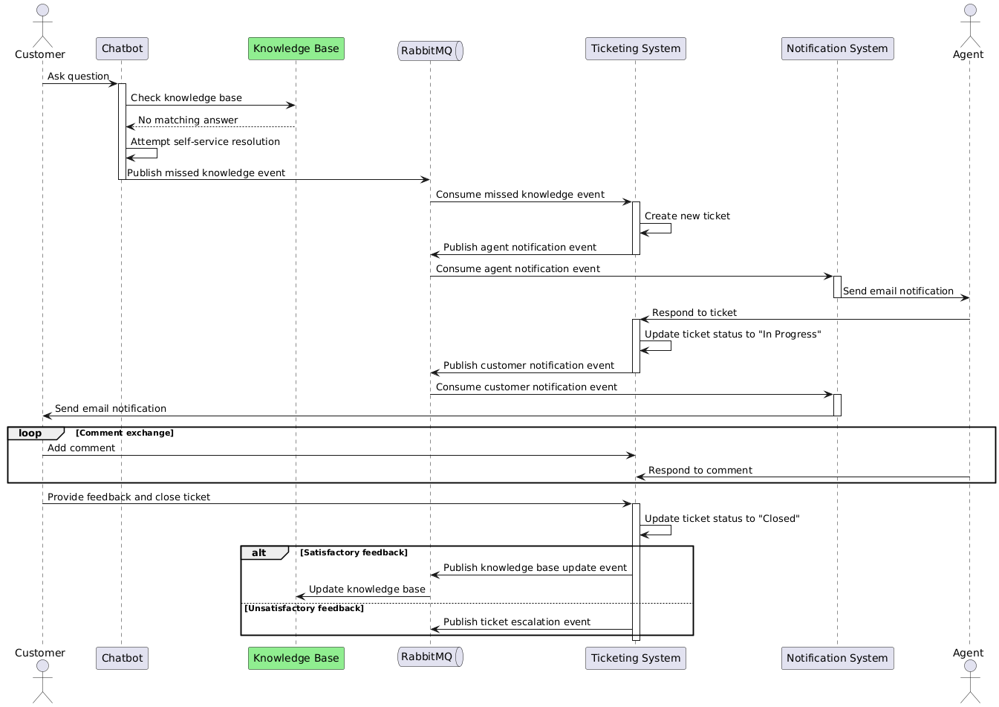

# CustoMater: Ticketing System

## Overview

CustoMater Ticketing System is an intelligent customer support solution that integrates AI-powered chatbots, a robust ticketing system, and a dynamic knowledge base. 
This system aims to streamline customer inquiries, automate responses, and continuously improve the knowledge base for more efficient customer service.



## Features

- AI-powered chatbot for initial customer interaction
- Automated ticket creation for unresolved queries
- Real-time notifications for agents and customers
- Knowledge base integration for quick answers
- Sentiment analysis for prioritizing urgent issues
- Scalable architecture using microservices

## System Architecture

The CustoMater AI Ticketing System is built on a microservices architecture, utilizing the following components:

- Frontend: React-based user interface
- Backend: NestJS API services
- Database: PostgreSQL for ticket and user data storage
- Message Queue: RabbitMQ for event-driven communication
- Search Engine: Elasticsearch for knowledge base

## Getting Started

### Prerequisites

- Node.js (v18 or later)
- Docker and Docker Compose

## Installation

```bash
$ npm install
```

## Running the app

```bash
# development
$ npm run start

# watch mode
$ npm run start:dev

# production mode
$ npm run start:prod
```

## Test

```bash
# unit tests
$ npm run test

# e2e tests
$ npm run test:e2e

# test coverage
$ npm run test:cov
```

## License

This project is licensed under the MIT License - see the [LICENSE.md](https://en.wikipedia.org/wiki/MIT_License) page for details.

## Acknowledgments

- OpenAI for providing the GPT model used in our chatbot
- Elasticsearch for powering our knowledge base search
- The open-source community for the various libraries and tools used in this project
